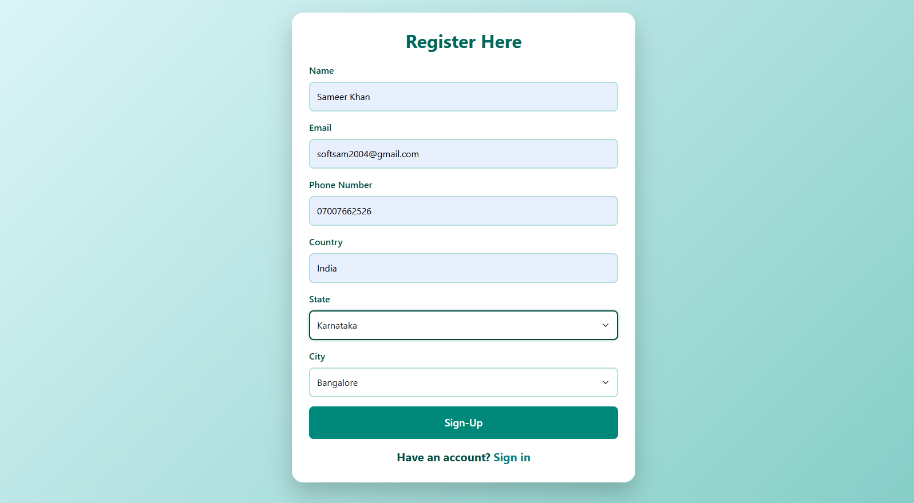
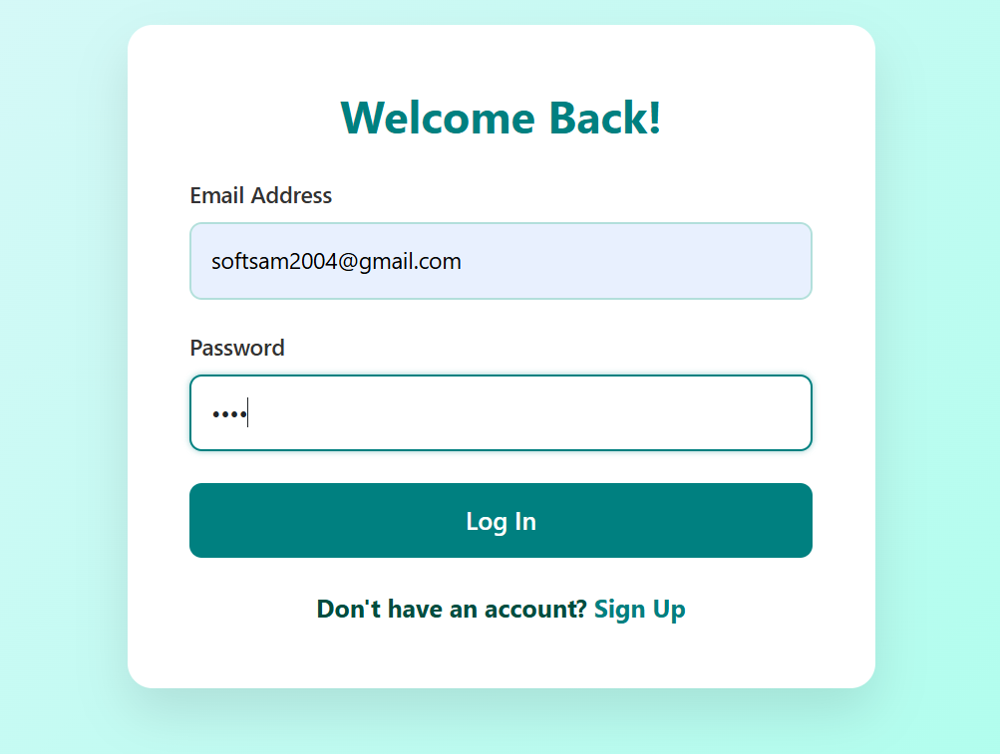
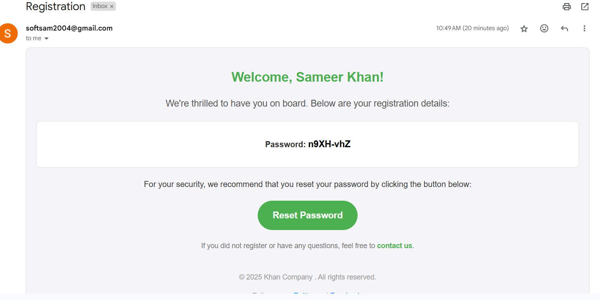
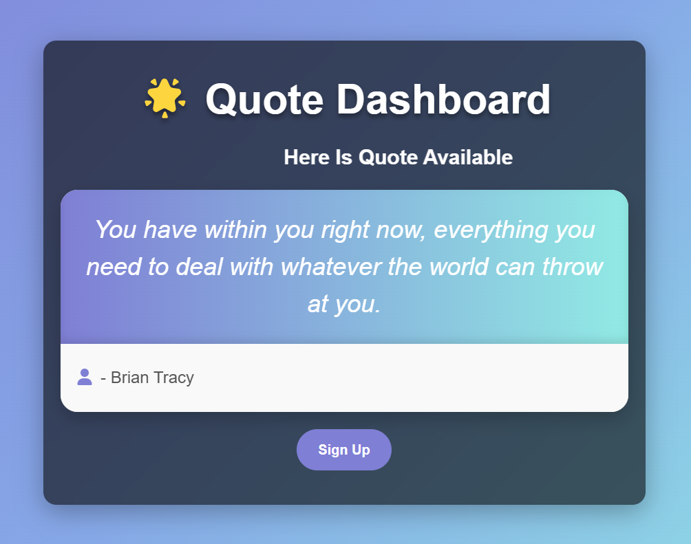
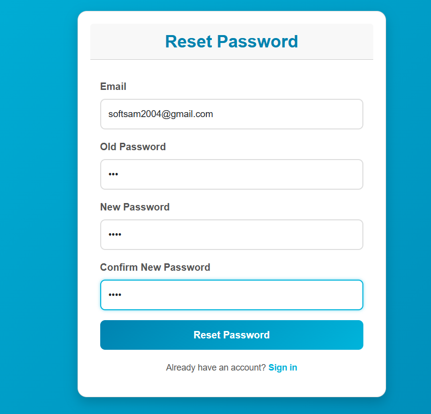

🌐 User Management Application

✨ A modern Spring Boot application with user registration, email verification, login, password reset, and a dashboard — built with Thymeleaf & Bootstrap 5.
   A Spring Boot + Thymeleaf web application designed to manage user registrations and authentications efficiently. The application facilitates user registration with email verification, secure login, password reset via email, and a personalized dashboard upon successful login.

📋 Table of Contents.

🌟 Features

⚙️ Tech Stack

🚀 Getting Started

🧪 Usage

📸 Screenshots

📦 Project Structure

🤝 Contributing

📄 License

📬 Contact

🌟 Features

✅ User Registration with Email Verification
✅ Login & Logout Functionality
✅ Forgot Password via Email
✅ Dashboard after successful login
✅ Responsive UI with Bootstrap 5
✅ Thymeleaf-based templates
✅ Role-based authentication (optional)
✅ In-memory or MySQL DB support

## ⚙️ Tech Stack

| 🧱 Layer        | 💡 Technology                          |
|----------------|----------------------------------------|
| **Backend**    | Java 17, Spring Boot                   |
| **Frontend**   | Thymeleaf, HTML5, CSS3, Bootstrap 5    |
| **Database**   | MySQL / H2 (in-memory)                 |
| **Email**      | Spring Boot Mail Sender                |
| **Build Tool** | Maven                                  |
| **Server**     | Embedded Apache Tomcat                 |

🚀 Getting Started

📦 Prerequisites
Java 17+
Maven 3.6+
MySQL (or H2 for testing)

🧰 Installation
bash
Copy
Edit
# Clone the repository
git clone https://github.com/serijkhan/User-Management-Application.git
cd User-Management-Application

# Configure your database
# Edit: src/main/resources/application.properties
⚙️ Build & Run
bash
Copy
Edit
mvn clean install
mvn spring-boot:run
📍 Visit the app at: http://localhost:7001/login

🧪 Usage.

👤 Register a new user.

📩 Check your email for the verification link.

🔐 Login using your credentials.

🛠 Reset Password if needed — a reset link is emailed.

📊 Dashboard is accessible after login.

📸 Screenshots
(Add your actual images in screenshots/ and replace paths below)

📝 Registration Page 

🔐 Login Page 

📩 Email Confirmation

📊 User Dashboard

🔁 Reset Your Pwd 

📦 Project Structure
plaintext
Copy
Edit
src/
 ┣ main/
 ┃ ┣ java/
 ┃ ┃ ┗ com.example.usermanagement/
 ┃ ┃    ┣ controller/
 ┃ ┃    ┣ service/
 ┃ ┃    ┣ model/
 ┃ ┃    ┗ repository/
 ┃ ┣ resources/
 ┃ ┃ ┣ templates/
 ┃ ┃ ┣ static/
 ┃ ┃ ┗ application.properties
 ┗ test/

🤝 Contributing.

🍴 Fork the repository

🛠 Create your feature branch: git checkout -b feature/YourFeature

💾 Commit your changes: git commit -m "Add your message"

🚀 Push to the branch: git push origin feature/YourFeature

📬 Open a Pull Request

📄 License
This project is licensed under the MIT License – see the LICENSE file for details.

📬 Contact
Sameer Khan
📧 Email: softsam2004@gmail.com
🔗 GitHub: @serijkhan

